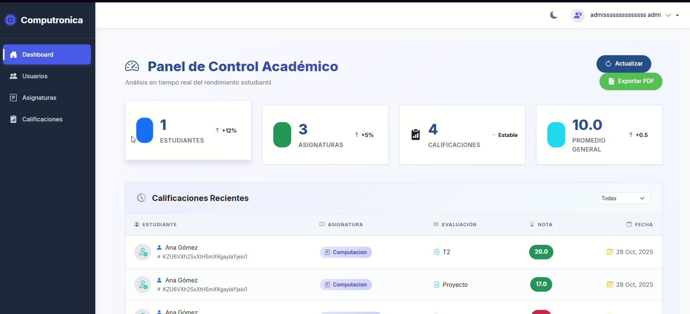
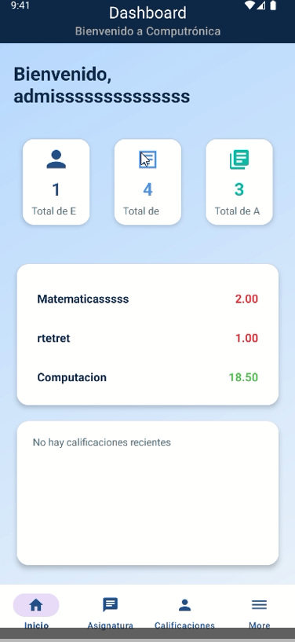
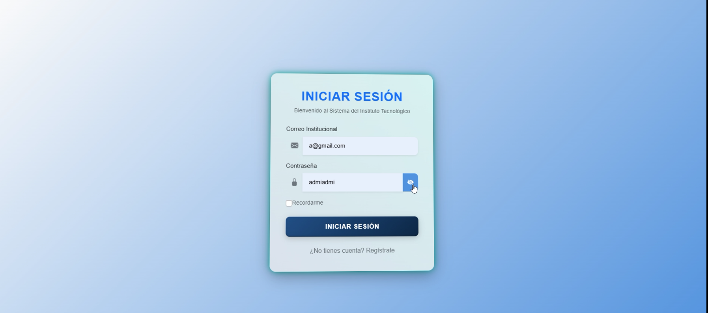
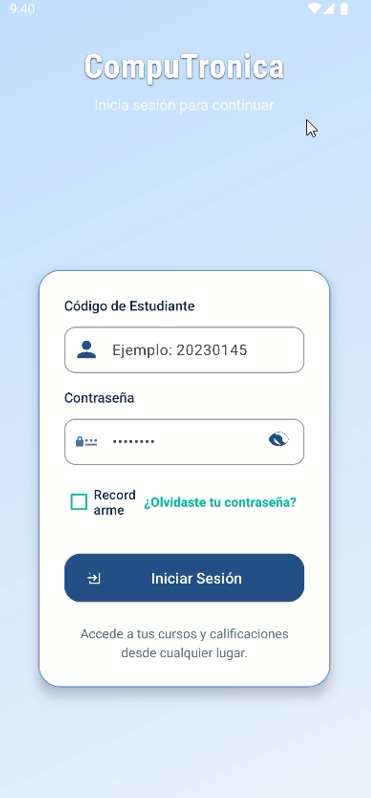

# 💻 Instituto Computrónica  
**Plataforma Académica Integral — Web & Móvil**

---

🚀 Proyecto Full Stack desarrollado con **Angular 20**, **Spring Boot**, **Firebase** y **Android Jetpack Compose**,  
orientado a la gestión académica, administrativa y de comunicación del Instituto Computrónica.

---

## 🧩 Tecnologías principales

| Capa | Tecnologías |
|------|--------------|
| 🌐 **Frontend Web** | Angular 20 (Standalone Components), RxJS, Bootstrap 5, AOS, NG Bootstrap |
| 📱 **App Móvil** | Android Studio + Kotlin + Jetpack Compose + Firebase |
| ⚙️ **Backend** | Spring Boot 3, Spring Security, JPA, Thymeleaf, REST API |
| 🔒 **Autenticación** | JWT + Firebase Auth + Spring Security |
| 🧠 **IA / ML** | TensorFlow Token (clasificación inteligente de datos) |
| ☁️ **Base de Datos** | Firebase Firestore + Realtime Database |
| 🧠 **Arquitectura** | MVC + DTO + Service Layer + OTA-PA Integrations |
| 🧰 **Dev Tools** | GitHub, Postman, JMeter (testing), Docker (para despliegue local) |

---

## 🏫 Sobre el proyecto

**Computrónica** es un ecosistema digital educativo que permite:  
- 📋 Gestionar estudiantes, docentes y administrativos.  
- 🎫 Controlar calificaciones, asignaturas y matrículas.  
- 🧾 Emitir boletas digitales y reportes académicos.  
- 📊 Visualizar estadísticas y actividades con dashboards.  
- 🔐 Autenticación segura por roles (Admin / Profesor / Estudiante).  
- 🔔 Notificaciones y sincronización en tiempo real vía Firebase.  
- 📱 Compatibilidad web–móvil con sincronización en la nube.

---

## 🧱 Arquitectura del Sistema

┌──────────────────────────────┐
│ Angular 20 (Web) │
│ - RxJS / Standalone / AOS │
│ - Bootstrap / SCSS / Pipes │
└──────────────┬───────────────┘
│ REST API
┌──────────────┴───────────────┐
│ Spring Boot 3 API │
│ - Spring Security / JWT │
│ - Service / Controller / DTO│
└──────────────┬───────────────┘
│
┌──────────────┴───────────────┐
│ Firebase Cloud │
│ Firestore | Auth | Storage │
└───────────────────────────────┘
│
┌──────────────┴───────────────┐
│ Android (Compose App) │
│ - Kotlin / Material 3 / MVVM│
└───────────────────────────────┘

---

## 🌟 Características destacadas

- 🎨 **UI/UX moderna y responsiva** con Angular Standalone y Bootstrap 5.  
- 🔄 **Integración completa con Firebase** (Auth, Firestore, Storage).  
- 🔐 **Seguridad avanzada** con Spring Security + JWT Tokens.  
- ⚙️ **API REST escalable** con arquitectura MVC.  
- 📱 **App móvil sincronizada** (Android Jetpack Compose).  
- 🤖 **IA integrada** con TensorFlow Token.  
- 📈 **Dashboard interactivo** con estadísticas y filtros dinámicos.  
- 🧾 **Módulos**: Usuarios, Calificaciones, Asignaturas, Reportes, etc.

---

## 🖼️ Capturas de pantalla

| 🖥️ Web | 📱 Móvil |
|--------|----------|
|  |  |
|  |  |

> 📌 *Las imágenes son representativas del diseño implementado en Angular y Android Studio.*

---

## ⚡ Estructura del repositorio

📦 computronica/
┣ 📁 backend/
┃ ┣ 📁 src/main/java/com/computronica/webapp/
┃ ┣ 📁 resources/
┃ ┗ 📄 pom.xml
┣ 📁 frontend/
┃ ┣ 📁 src/app/
┃ ┣ 📁 src/assets/
┃ ┗ 📄 angular.json
┣ 📁 mobile/
┃ ┣ 📁 app/src/main/
┃ ┗ 📄 build.gradle
┣ 📄 README.md
┗ 📄 package.json
